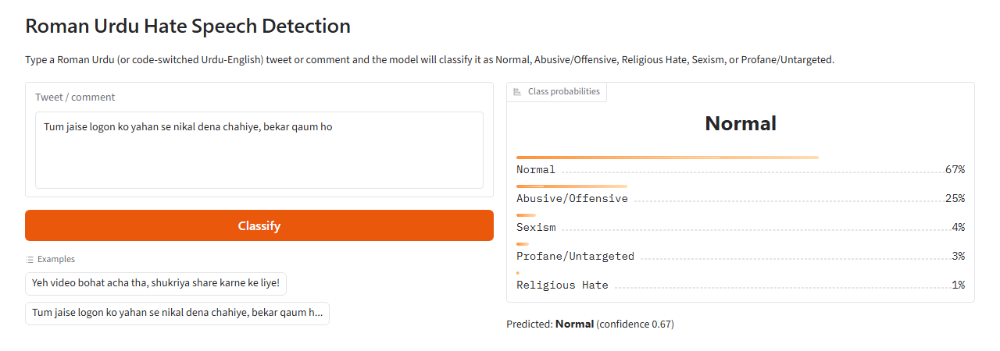
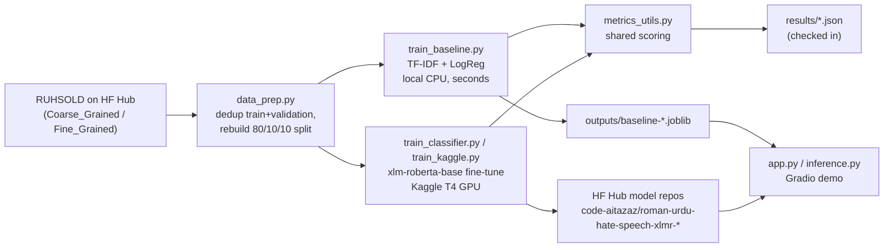

# Roman Urdu Hate Speech Detection


[](https://huggingface.co/code-aitazaz)
[](https://huggingface.co/datasets/community-datasets/roman_urdu_hate_speech)

Classify Roman Urdu (Urdu written in Latin script, heavily code-switched with
English) tweets and social-media comments as **Normal** or one of several
offensive/hateful categories. Roman Urdu dominates everyday Pakistani social media
but has almost no moderation tooling compared to English — mainstream hate-speech
classifiers largely can't read it.

Built on **RUHSOLD** (Roman Urdu Hate-Speech and Offensive Language Dataset;
Rizwan, Shakeel & Karim, *"Hate-Speech and Offensive Language Detection in Roman
Urdu"*, EMNLP 2020 — [aclanthology.org/2020.emnlp-main.197](https://aclanthology.org/2020.emnlp-main.197)):
10,012 Roman Urdu tweets, expert-annotated at two granularities. Hosted on the
Hugging Face Hub as [`community-datasets/roman_urdu_hate_speech`](https://huggingface.co/datasets/community-datasets/roman_urdu_hate_speech)
(MIT-licensed).



Two label schemes (configs):

- **`Coarse_Grained`** (binary): `Abusive/Offensive` vs `Normal`.
- **`Fine_Grained`** (5-class, primary task): `Abusive/Offensive`, `Normal`,
  `Religious Hate`, `Sexism`, `Profane/Untargeted` — imbalanced (Normal is the
  majority class), and the more novel/interesting task since it requires telling
  *what kind* of offense is present, not just offensive-or-not.

## Approach

- **Data quality**: the HF Hub port of RUHSOLD has real split-integrity issues,
  found by inspection while building `src/data_prep.py` — `test` ships with every
  label withheld (`None`) for *both* configs (almost certainly reserved for a
  private shared-task leaderboard), and `Fine_Grained`'s `validation` is an exact
  duplicate of its `train` (same 7,208 tweets, same labels, same order).
  `Coarse_Grained`'s `validation` is a genuine, distinct split. Rather than
  trusting the upstream split boundaries, `data_prep.py` pools every uniquely
  labeled tweet across `train` + `validation` (deduplicated by tweet text, which
  also neutralizes the Fine_Grained bug), drops the unusable `test`, and rebuilds
  its own stratified 80/10/10 train/val/test split from that pool. See
  `_collect_labeled_pool` / `build_splits` in `src/data_prep.py`.
- **Task**: standard sequence classification (`AutoModelForSequenceClassification`).
  Tweets are short (6–380 chars), so — unlike a long-document task — no
  sliding-window tokenization or offset-mapping postprocessing is needed; a
  transformer's normal truncate-and-pad handling is enough.
- **Model**: [`xlm-roberta-base`](https://huggingface.co/xlm-roberta-base),
  fine-tuned per config. Its SentencePiece vocabulary (trained on CC-100, 100
  languages including Hindi/Urdu-family data) tends to segment Romanized,
  code-switched text more sensibly than `bert-base-multilingual-cased`'s older
  WordPiece vocab, and XLM-R generally edges out mBERT on multilingual
  classification benchmarks (XNLI, PAWS-X). mBERT was considered as an
  alternative/second baseline but wasn't added, to keep scope focused.
- **Classical baseline**: TF-IDF (word 1–2 grams) + `LogisticRegression`, trained
  in seconds on CPU (`src/train_baseline.py`) — an honest "does the transformer
  actually help" comparison row, run before ever touching GPU quota.
- **Class imbalance**: both the transformer and the baseline use
  `class_weight="balanced"` (computed at runtime from the train split, not
  hardcoded). **Macro-F1** is the headline/model-selection metric, not accuracy,
  since accuracy on an imbalanced 5-class task is dominated by the majority
  `Normal` class.
- **Evaluation**: accuracy, macro-F1, weighted-F1, per-class precision/recall/F1
  (worst classes first), and a confusion matrix — see
  [`src/metrics_utils.py`](src/metrics_utils.py) for the exact definitions. The
  transformer and the baseline are scored through the *same* metrics function, so
  the two are directly comparable.
- **Compute**: transformer fine-tuning runs on a free Kaggle T4 GPU kernel, driven
  from this repo via the Kaggle API. Both configs train on Kaggle: `Fine_Grained`
  via `kaggle/`, `Coarse_Grained` via `kaggle/coarse/` (its own kernel-metadata.json,
  since a Kaggle kernel push needs one metadata file per kernel id). We initially
  assumed `Coarse_Grained` (binary, ~6.4k train tweets) would be cheap enough for
  local CPU fine-tuning — measured on this machine it projected to 20+ hours for
  5 epochs (xlm-roberta-base's 270M params on CPU, ~80-100s/step), so it moved to
  Kaggle too. The TF-IDF baseline is unaffected and still runs locally in seconds
  for both configs.

## Pipeline



### Models on the Hugging Face Hub

The two fine-tuned checkpoints are public and loadable directly (no local training
required):

- [`code-aitazaz/roman-urdu-hate-speech-xlmr-fine-grained`](https://huggingface.co/code-aitazaz/roman-urdu-hate-speech-xlmr-fine-grained) — 5-class
- [`code-aitazaz/roman-urdu-hate-speech-xlmr-coarse-grained`](https://huggingface.co/code-aitazaz/roman-urdu-hate-speech-xlmr-coarse-grained) — binary

```python
from transformers import AutoModelForSequenceClassification, AutoTokenizer

repo = "code-aitazaz/roman-urdu-hate-speech-xlmr-fine-grained"
tokenizer = AutoTokenizer.from_pretrained(repo)
model = AutoModelForSequenceClassification.from_pretrained(repo)
```

## Repo layout

```
src/
  data_prep.py         # load RUHSOLD (both configs) from the HF Hub, build splits, sanity-check
  clf_utils.py           # tokenization, class-weight computation, weighted-loss Trainer, batched inference
  metrics_utils.py         # accuracy/macro-F1/weighted-F1/per-class/confusion-matrix, shared by transformer + baseline
  train_baseline.py          # TF-IDF + Logistic Regression, real (not smoke-tested), CPU, seconds
  train_classifier.py          # local/CPU-friendly xlm-roberta-base fine-tuning entry point (+ --smoke-test)
  train_kaggle.py                # end-to-end train+eval driver, inlined into the Kaggle notebook
  evaluate.py                      # run a trained model against val/test, write results/metrics.json
  inference.py                       # single-example prediction wrapper used by the demo app
kaggle/
  kernel-metadata.json                 # Fine_Grained kernel config (GPU T4, internet on) -- primary task
  train_kernel.ipynb                     # auto-generated from src/ -- see scripts/build_kaggle_notebook.py
  coarse/
    kernel-metadata.json                   # Coarse_Grained's own kernel (own id, GPU T4)
    train_kernel.ipynb                       # auto-generated with --config Coarse_Grained
app/
  app.py                                    # Gradio demo
scripts/
  smoke_test.py                                # local pipeline sanity check (tiny model, CPU)
  build_kaggle_notebook.py                       # regenerates kaggle/train_kernel.ipynb from src/
results/
  metrics.json                                     # transformer results, keyed by config (checked in)
  baseline_metrics.json                              # TF-IDF+LogReg results, keyed by config (checked in)
```

## Setup

```bash
python -m venv .venv
.venv\Scripts\activate        # Windows
pip install -r requirements.txt
```

## Running it

**1. Prepare data (both configs):**

```bash
python src/data_prep.py
```

**2. Run the classical baseline for real — cheap, CPU, seconds:**

```bash
python src/train_baseline.py
```

**3. Sanity-check the full pipeline locally (CPU, no GPU needed):**

```bash
python scripts/smoke_test.py
```

This runs the baseline, then a tiny one-epoch CPU transformer run, then evaluation
and inference, to catch bugs before spending any GPU quota.

**4. Fine-tune `Fine_Grained` on Kaggle's free T4 GPU:**

1. Create a free [Kaggle](https://www.kaggle.com) account if you don't have one,
   then get an API token: Account → Settings → API → *Create New Token* (downloads
   `kaggle.json`).
2. Place it at `~/.kaggle/kaggle.json` (Windows: `%USERPROFILE%\.kaggle\kaggle.json`).
3. Edit `kaggle/kernel-metadata.json` if you're not `aitazazahsan01` on Kaggle.
4. Push and run:
   ```bash
   pip install kaggle
   cd kaggle
   kaggle kernels push --accelerator NvidiaTeslaT4
   kaggle kernels status <username>/roman-urdu-hate-speech-detection-training
   kaggle kernels output <username>/roman-urdu-hate-speech-detection-training -p ../kaggle_output
   ```
   The `--accelerator` flag matters: without it Kaggle may hand out an older P100,
   whose CUDA architecture (sm_60) recent PyTorch wheels no longer support, and
   training fails with `no kernel image is available for execution on the device`.

   (`train_kernel.ipynb` is auto-generated from `src/` — see
   `scripts/build_kaggle_notebook.py`; rerun it if you change the training code.)

**5. Fine-tune `Coarse_Grained` on Kaggle too:**

CPU fine-tuning of `xlm-roberta-base` turned out to be impractical (~80-100s/step
measured, projecting 20+ hours for 5 epochs even on this small binary task), so
`Coarse_Grained` gets its own Kaggle kernel in `kaggle/coarse/` rather than running
locally:

```bash
cd kaggle/coarse
kaggle kernels push --accelerator NvidiaTeslaT4
kaggle kernels status <username>/roman-urdu-hate-speech-detection-training-coarse
kaggle kernels output <username>/roman-urdu-hate-speech-detection-training-coarse -p ../../kaggle_output_coarse
```

(Regenerate its notebook with `python scripts/build_kaggle_notebook.py --config Coarse_Grained` if you change the training code.)

**6. Evaluate a trained model:**

```bash
python src/evaluate.py --model-dir kaggle_output/outputs/xlmr-fine_grained --config Fine_Grained --split test
```

**7. Run the demo:**

```bash
python app/app.py --model-dir kaggle_output/outputs/xlmr-fine_grained
python app/app.py --model-dir kaggle_output_coarse/outputs/xlmr-coarse_grained

# Or the TF-IDF+LogReg baseline instead -- worth trying on Fine_Grained, since it
# currently beats the transformer there (see Results below):
python app/app.py --model-dir outputs/baseline-fine_grained.joblib --baseline
```

`src/inference.py` supports the same `--baseline` flag for single command-line
predictions without launching the UI.

## Results

All numbers below are on our own re-split test set (see "Data quality" above —
not directly comparable split-for-split to the original paper, which is why its
row is footnoted). See `results/metrics.json` and `results/baseline_metrics.json`
for the full per-class breakdown and confusion matrices.

### Fine_Grained (5-class, n=721 test)

| Model | Accuracy | Macro-F1 |
|---|---|---|
| BERT+CNN-gram (Rizwan et al., 2020)† | 0.82 | 0.75 |
| TF-IDF + Logistic Regression (ours) | 0.743 | 0.677 |
| XLM-R fine-tuned (ours) | 0.682 | 0.617 |

**The classical baseline currently beats the XLM-R fine-tune on both metrics** —
a real, honestly-reported result, not a bug. With only 5,760 training tweets and
5 epochs of untuned fine-tuning (default learning rate, no hyperparameter search),
a 270M-parameter multilingual transformer is plausibly data-starved relative to a
TF-IDF bag-of-words model on this task size. Promising next steps: more epochs,
an LR sweep, or a smaller/more sample-efficient encoder (e.g. `distilbert`-style)
that's less prone to overfitting on ~6k examples.

**XLM-R confusion matrix** (rows = true label, columns = predicted; diagonal =
correct, bold):

| True \ Predicted | Abusive/Offensive | Normal | Religious Hate | Sexism | Profane/Untargeted |
|---|---|---|---|---|---|
| **Abusive/Offensive** | **76** | 30 | 12 | 32 | 23 |
| **Normal** | 34 | **289** | 38 | 11 | 13 |
| **Religious Hate** | 3 | 4 | **45** | 3 | 2 |
| **Sexism** | 6 | 4 | 2 | **48** | 0 |
| **Profane/Untargeted** | 3 | 4 | 2 | 3 | **34** |

The biggest confusable pair is `Abusive/Offensive` vs. `Normal` (34 + 30 = 64
mistakes between just these two) — the two most semantically overlapping classes
in the label scheme, which tracks with `Abusive/Offensive` having the lowest F1
(0.515) of all five classes.

### Coarse_Grained (binary, n=800 test)

| Model | Accuracy | Macro-F1 |
|---|---|---|
| BERT+CNN-gram (Rizwan et al., 2020)† | 0.90 | 0.90 |
| TF-IDF + Logistic Regression (ours) | 0.836 | 0.835 |
| XLM-R fine-tuned (ours) | 0.873 | 0.872 |

Here XLM-R *does* beat the classical baseline (unlike Fine_Grained above) — the
binary task has ~6.4k roughly-balanced training tweets per class pairing, more
signal per class than Fine_Grained's five-way split of a similar-sized pool, which
is consistent with the "transformer needs more data per class" read from the
Fine_Grained result.

**XLM-R confusion matrix:**

| True \ Predicted | Abusive/Offensive | Normal |
|---|---|---|
| **Abusive/Offensive** | **317** | 55 |
| **Normal** | 47 | **381** |

† Secondary-sourced from summaries of the original paper — the primary PDF
couldn't be rendered to independently verify the exact metric definitions
(macro vs. weighted F1), and the original paper's split differs from ours (see
"Data quality"). Treat as an approximate literature reference, not an exact
apples-to-apples number.

## License

Code: MIT. Data: RUHSOLD / `community-datasets/roman_urdu_hate_speech` is
MIT-licensed on the Hugging Face Hub; please also cite Rizwan et al. (EMNLP 2020)
if you use the dataset.
